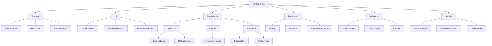

# ✨ Pierre Bouteman Portfolio

[](https://nexos20lv.github.io/)
[](https://nexos20lv.github.io/)
[](https://supabase.com/)
[](https://discord.com/)

Portfolio personnel oriente performance, identite visuelle forte et donnees temps reel.

Le projet repose sur une base statique simple a maintenir, enrichie par plusieurs integrations externes:

- GitHub API pour les statistiques globales et par projet
- Lanyard pour la presence Discord
- Supabase pour la disponibilite et le compteur de visiteurs
- Telegram Bot API pour recevoir les messages de contact
- GitHub Pages pour le deploiement
- un bot Node.js pour synchroniser un statut Discord vers Supabase

## 👀 Apercu

Site en ligne: https://nexos20lv.github.io/

Le portfolio propose notamment:

- une interface immersive en HTML, CSS et JavaScript vanilla
- une experience bilingue FR / EN
- une grille projets avec modales detaillees
- des badges d'etat projet et indicateurs de build
- des stats GitHub robustes avec gestion du rate limit
- un mode performance pour alleger les animations
- une recherche rapide des projets
- une carte Discord temps reel
- un compteur de visiteurs en direct via Supabase Presence

## 🪪 Highlights

| Carte | Description |
| --- | --- |
| 🚀 Experience premium | Interface immersive, loader terminal, animations dosees et design plus compact sur mobile. |
| 📡 Donnees live | Presence Discord, disponibilite synchronisee, visiteurs en temps reel et statistiques GitHub. |
| 🧩 Base simple a maintenir | Stack front sans framework, structure lisible et logique centralisee dans quelques fichiers cles. |
| 🛡️ Approche solide | Gestion du rate limit GitHub, policies RLS Supabase et separation claire entre lecture publique et ecriture service role. |

## 🧠 Carte mentale



## 🧱 Stack

### 🎨 Frontend

- HTML5
- CSS3 modulaire
- JavaScript ES Modules
- Bootstrap Icons
- Devicon
- Google Fonts

### 🌐 Services externes

- GitHub API
- Lanyard WebSocket API
- Supabase Realtime
- GitHub Pages

### ⚙️ Outils serveur

- Node.js
- discord.js
- @supabase/supabase-js
- dotenv

## 🚀 Points forts du projet

### 🧠 Experience utilisateur

- loader type terminal
- curseur personnalise
- fond visuel mesh
- design compact optimise mobile
- modales projet plus rapides a ouvrir

### 📡 Donnees dynamiques

- statut de disponibilite pilote depuis Discord
- visiteurs actifs suivis en temps reel
- statistiques GitHub globales
- statistiques GitHub par projet si le repo existe
- masquage automatique des stats sur les projets sans repo GitHub

### 🛡️ Robustesse

- filtrage des reponses GitHub invalides
- gestion du rate limit GitHub sans casser l'UI
- RLS prevu pour Supabase
- deploiement automatise via GitHub Actions

## 📁 Structure du repository

```text
.
├── .github/
│   └── workflows/
│       └── static.yml
├── assets/
│   ├── logo.svg
│   └── og-image.svg
├── bot/
│   ├── index.js
│   └── package.json
├── css/
│   ├── base.css
│   ├── components.css
│   └── style.css
├── js/
│   ├── app.js
│   ├── config.js
│   ├── i18n.js
│   ├── main.js
│   └── particles.js
├── CNAME
├── index.html
├── README.md
└── supabase_hardening.sql
```

## 🔎 Comment ca fonctionne

### 1. 🖥️ Front statique

Le site est servi comme un projet statique pur. Il n'y a pas de build frontend obligatoire ni de framework a compiler.

### 2. 🔄 Disponibilite temps reel

Le bot Discord ecoute un salon cible, parse les messages de l'utilisateur autorise, puis met a jour la table Supabase `portfolio_status`.

Le frontend lit ensuite cette table pour afficher:

- le statut disponible / occupe
- le nombre de projets actifs

### 3. 💬 Presence Discord

La carte Discord du site utilise Lanyard pour recuperer:

- avatar
- statut online / idle / dnd / offline
- activite en cours
- ecoute Spotify si presente

### 4. 📊 Statistiques GitHub

Le frontend interroge GitHub pour afficher:

- le nombre total de repos
- les stars totales
- la repartition des langages
- des donnees par projet dans la modal

Quand un projet n'a pas de repo GitHub, les blocs dependants de GitHub sont automatiquement masques.

## 🧪 Lancer le projet en local

Comme le site est statique, un simple serveur HTTP suffit.

### Option 1 ⚡

```bash
python3 -m http.server 8080
```

### Option 2 📦

```bash
npx serve .
```

Ensuite ouvrir:

```text
http://localhost:8080
```

## 🔧 Configuration frontend

Le fichier `js/config.js` contient la configuration publique utilisee par le frontend:

```js
export const config = {
	supabaseUrl: 'https://...supabase.co',
	supabaseAnonKey: 'sb_publishable_...'
};
```

Ces valeurs sont publiques par design pour un client Supabase cote navigateur. La securite d'ecriture repose sur les policies RLS, pas sur le secret de cette cle.

## 🤖 Bot Discord -> Supabase

Le bot se trouve dans le dossier `bot/`.

### 📥 Installation

```bash
cd bot
npm install
```

### 🔐 Variables d'environnement attendues

Creer un fichier `.env` dans `bot/` avec:

```env
DISCORD_BOT_TOKEN=...
DISCORD_STATUS_CHANNEL_ID=...
ALLOWED_USER_ID=...
SUPABASE_URL=...
SUPABASE_SERVICE_ROLE_KEY=...
```

### ▶️ Demarrage

```bash
npm start
```

### 🧭 Comportement du bot

Le bot:

- ignore tous les bots
- ignore les salons non autorises
- ignore les utilisateurs non autorises
- applique un cooldown pour eviter le spam
- parse un nombre pour les projets actifs
- parse les mots cles de disponibilite
- upsert ensuite la ligne `id = 1` dans `portfolio_status`

### 💡 Exemples de messages interpretes

- `dispo`
- `busy`
- `indisponible 3`
- `available 1`
- `2`

## 🗄️ Supabase

Le fichier `supabase_hardening.sql` contient une base de durcissement pour la table `portfolio_status`.

Objectif:

- lecture publique autorisee
- ecriture reservee au role service

Cela permet au frontend de lire librement l'etat du portfolio tout en reservant les modifications au bot.

## ✉️ Contact -> Telegram (Edge Function)

Les formulaires de contact frontend envoient leurs messages a:

- `functions/v1/contact-handler`

La fonction edge se trouve ici:

- `supabase/functions/contact-handler/index.ts`

Secrets requis cote Supabase:

```env
TELEGRAM_BOT_TOKEN=...
TELEGRAM_CHAT_ID=...
```

Deploiement:

```bash
supabase functions deploy contact-handler
```

Le bot Discord dans `bot/` reste uniquement dedie au statut de disponibilite.

## 🚢 Deploiement

Le deploiement est gere par GitHub Actions via `.github/workflows/static.yml`.

Le workflow:

- se declenche sur push vers `main`
- prepare GitHub Pages
- publie le contenu du repository
- injecte un numero de version derive du commit pour le cache busting

Le site est ensuite publie sur GitHub Pages avec le domaine configure dans `CNAME`.

## 🌍 SEO et partage social

Le projet inclut:

- des metas Open Graph
- des metas Twitter Card
- une image de partage dediee
- un contenu FR / EN exploitable par les moteurs et apercus sociaux

Si Discord ou un autre service garde un ancien apercu, il peut etre necessaire d'attendre le refresh de cache ou de republier le lien avec un parametre de version.

## 🛠️ Personnalisation rapide

### ✍️ Contenu et textes

- `js/i18n.js` pour les textes FR / EN
- `index.html` pour la structure

### 🎛️ Style

- `css/base.css` pour les variables globales
- `css/components.css` pour les composants et le responsive

### 🧩 Logique

- `js/app.js` pour les interactions UI, APIs et modales
- `js/particles.js` pour le rendu visuel d'arriere-plan

## 🔮 Ameliorations possibles

- remplacer l'image Open Graph SVG par une version PNG pour une compatibilite embed maximale
- ajouter un endpoint serveur pour proxyfier certaines requetes GitHub et reduire l'exposition au rate limit
- sortir les donnees projets dans un JSON ou une source CMS legere
- ajouter un vrai pipeline de tests visuels ou de validation front

## 📄 Licence

Projet personnel.

Le code source est visible publiquement mais aucune licence open source explicite n'est fournie a ce stade. En pratique, cela signifie que tous les droits restent reserves par defaut sauf autorisation explicite.

## 🙌 Credits

- Design et developpement: Pierre Bouteman
- Icons: Bootstrap Icons, Devicon
- Presence Discord: Lanyard
- Realtime: Supabase
- Hebergement: GitHub Pages
